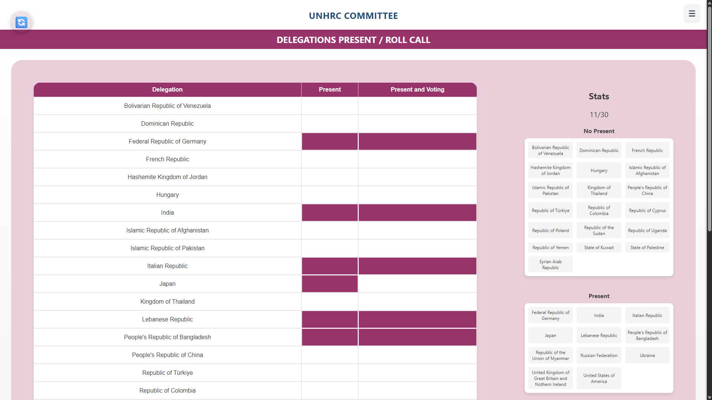
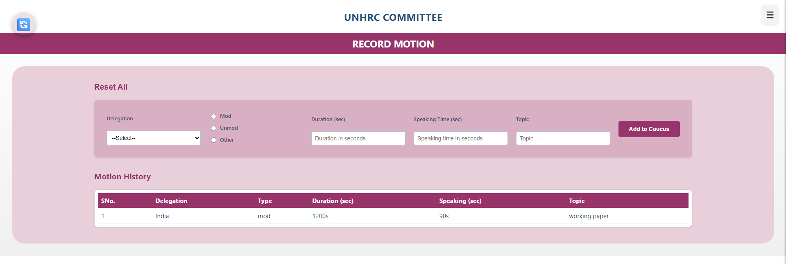

# 🌐 Chair MUN Website – Full Stack (MERN + WebSocket + SQLite)

This is a full-stack web application developed for the **Model United Nations (MUN)** Club. The platform enables management of MUN events, real-time interactions, and committee oversight.

🛠 Built by the **Tech Team** for an internal MUN Club event.


## 🧱 Tech Stack

| Layer       | Technology                          |
|-------------|-------------------------------------|
| Frontend    | React.js, HTML, CSS                 |
| Backend     | Node.js, Express.js, WebSocket      |
| Database    | SQLite (local development)          |
| Real-Time   | WebSocket / Socket.IO               |
| Versioning  | Git & GitHub                        |

---

## 📁 Project Structure

```
/VITBMUN_EVENT
│
├── /vitbmun_event_frontend         # React frontend
│   └── src/
│
├── /mun_backend         # Node.js backend
│   └── routes/
│   └── controllers/
│
└── README.md       # Project overview
```

---

## 🔥 Features

- 🎯 Role-based access for MUN chairs
- 🖥️ Responsive UI using React
- ⚡ Real-time updates with WebSocket (Socket.IO)
- 🗃️ SQLite used for quick local development
- 🔗 Seamless frontend-backend API integration

---

## 🚀 Getting Started

### 1. Clone the repository

```bash
git clone https://github.com/your-username/your-repo.git
cd VITBMUN
```

### 2. Setup Backend

```bash
cd mun_backend
npm install
node index.js
```

> The backend runs on `http://localhost:5000` by default.

### 3. Setup Frontend

```bash
cd vitbmun_event_frontend
npm install
npm run dev
```

> The frontend runs on `http://localhost:3000` by default.

---

## 🧠 API Endpoints (Backend)

### 📊 /status Routes

| Method | Route                          | Description                                                              |
|--------|--------------------------------|---------------------------------------------------------------------------|
| GET   | `/api/status/attendance`              | Attendance Values                                                               |
| GET   | `/api/status/motionTypes`              | Give Motion Types                                              
                                        

---

### 📌 /committee Routes

| Method | Route                | Description                         |
|--------|----------------------|-------------------------------------|
| POST   | `/api/committee/add` | Add a new committee (name required) |
| GET    | `/api/committee/get` | Get committee details by ID         |

---

### 🌍 /country Routes

| Method | Route                   | Description                                      |
|--------|-------------------------|--------------------------------------------------|
| POST   | `/api/country/add`      | Add country to a committee                      |
| GET    | `/api/country/all`      | Get country names with attendance status        |
| GET    | `/api/country/values`  | Get Allowed Countries               |
| POST   | `/api/country/update`   | Update country attendance for a committee       |

---

### 🗳️ /motion Routes

| Method | Route                   | Description                                                  |
|--------|-------------------------|--------------------------------------------------------------|
| GET    | `/api/motion/all`       | Get all motions by committee ID                             |
| POST   | `/api/motion/add`    | Create a new motion (with topic, speaker list, type, etc.)  |

---

### 🗣️ /gsl (General Speakers List) Routes

| Method | Route              | Description                             |
|--------|--------------------|-----------------------------------------|
| GET    | `/api/gsl/`     | Get general speaker list by committee   |
| POST   | `/api/gsl/add`     | Add country to speaker list for a committee |


---
### 🗣️ /voting Routes

| Method | Route              | Description                             |
|--------|--------------------|-----------------------------------------|
| GET    | `/api/voting/`     | Get Countries That Are Present & Voting  |


---

## 📸 Screenshots




---

## 👨‍💻 Contributors

| Name                  | Roles                                         |
|-----------------------|-----------------------------------------------|
| Gurkirat Singh Dillon | 🔧 Backend Integration, ⚡ WebSocket Setup     |
| Harshita Jaiswal      | 🛢️ DB Setup, 🔁 Routes                    |
| Vansh Kashyap         | 🎨 Frontend Development                        |
| Kunal Singh           | 📡 API Development                             |
| Saksham Jaiswal       | 🖥️ Frontend Development, ⚡ WebSocket Setup     |


---

## 📂 SQLite Usage

We used **SQLite** as our local dev database for its simplicity. You can view or manage the `.db` file using tools like DB Browser for SQLite.

---

## 📢 License

MIT – Feel free to use or contribute.

---

